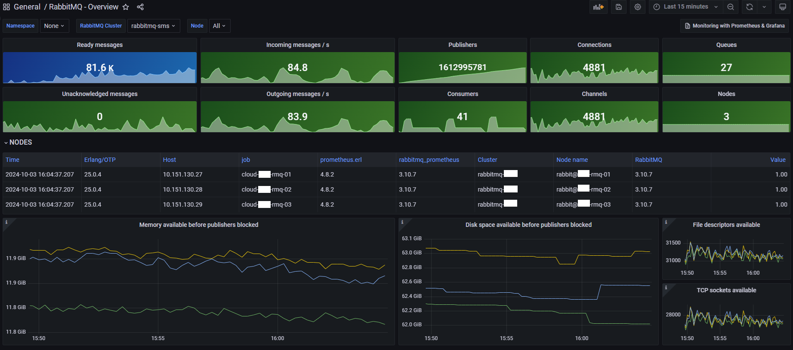

# Giám sát hiệu suất RabbitMQ với Prometheus

# 1. Giới thiệu

RabbitMQ là một trong những hệ thống hàng đợi tin nhắn phổ biến nhất, giúp các ứng dụng giao tiếp một cách hiệu quả và đáng tin cậy. Để đảm bảo rằng RabbitMQ hoạt động ổn định và hiệu suất cao, việc giám sát là vô cùng quan trọng.

Plugin Prometheus của RabbitMQ cho phép bạn dễ dàng thu thập và xuất số liệu về hoạt động của RabbitMQ. Với Prometheus, bạn có thể theo dõi các chỉ số quan trọng như số lượng tin nhắn, tình trạng hàng đợi, và nhiều thông tin khác, giúp bạn phát hiện kịp thời các vấn đề và tối ưu hóa hiệu suất hệ thống.

# 2. Kích hoạt Plugin Prometheus

- RabbitMQ có sẵn plugin Prometheus mặc định. Để kích hoạt, bạn chỉ cần sử dụng lệnh sau:

```jsx
sudo rabbitmq-plugins enable rabbitmq_prometheus
```

- Kiểm tra trạng thái plugin.

Để xác nhận rằng plugin đã được kích hoạt, bạn có thể chạy lệnh:

```
rabbitmq-plugins list
```

Bạn sẽ thấy `rabbitmq_prometheus` được đánh dấu là "E" (enabled).

- Cấu hình firewall (nếu có). Nếu firewall đang chạy, hãy thêm quy tắc cho port `15692`:

```jsx
sudo firewall-cmd --permanent --zone=public --add-port=15692/tcp
sudo firewall-cmd --reload
```

# 3. Cấu Hình Prometheus

- Mở file `prometheus.yml` và thêm job để thu thập số liệu từ RabbitMQ:

```jsx
scrape_configs:
  # The job name is added as a label `job=<job_name>` to any timeseries scraped from this config.
  - job_name: 'cloud-rmq-01'
    static_configs:
      - targets: ['10.150.130.27:15692']
    relabel_configs:
    - source_labels: [__address__]
      separator: ':'
      regex: '(.*):(.*)'
      replacement: '${1}'
      target_label: instance
```

- Khởi động lại Prometheus:

```jsx
sudo systemctl restart prometheus
```

# 4. Tạo Alert Rule

- Alert rule default: [rabbitmq_alerts.yml](https://raw.githubusercontent.com/samber/awesome-prometheus-alerts/master/dist/rules/rabbitmq/rabbitmq-exporter.yml)
- Tạo 1 file quy tắc cảnh báo `rabbitmq_alerts.yml` trong `/etc/prometheus/alert_rules` với nội dung sau:

```jsx
groups:

- name: RabbitmqExporter

  rules:

    - alert: RabbitmqNodeDown
      expr: 'sum(rabbitmq_build_info) < 3'
      for: 0m
      labels:
        severity: critical
        monitor: "RabbitMQ"
      annotations:
        summary: RabbitMQ node down (instance {{ $labels.instance }})
        description: "Less than 3 nodes running in RabbitMQ cluster\n  VALUE = {{ $value }}"

    - alert: RabbitmqNodeNotDistributed
      expr: 'erlang_vm_dist_node_state < 3'
      for: 0m
      labels:
        severity: critical
        monitor: "RabbitMQ"
      annotations:
        summary: RabbitMQ node not distributed (instance {{ $labels.instance }})
        description: "Distribution link state is not 'up'\n  VALUE = {{ $value }}"

    - alert: RabbitmqInstancesDifferentVersions
      expr: 'count(count(rabbitmq_build_info) by (rabbitmq_version)) > 1'
      for: 1h
      labels:
        severity: warning
        monitor: "RabbitMQ"
      annotations:
        summary: RabbitMQ instances different versions (instance {{ $labels.instance }})
        description: "Running different version of RabbitMQ in the same cluster, can lead to failure.\n  VALUE = {{ $value }}"

    - alert: RabbitmqMemoryHigh
      expr: 'rabbitmq_process_resident_memory_bytes / rabbitmq_resident_memory_limit_bytes * 100 > 90'
      for: 2m
      labels:
        severity: warning
        monitor: "RabbitMQ"
      annotations:
        summary: RabbitMQ memory high (instance {{ $labels.instance }})
        description: "A node use more than 90% of allocated RAM\n  VALUE = {{ $value }}"

    - alert: RabbitmqFileDescriptorsUsage
      expr: 'rabbitmq_process_open_fds / rabbitmq_process_max_fds * 100 > 90'
      for: 2m
      labels:
        severity: warning
        monitor: "RabbitMQ"
      annotations:
        summary: RabbitMQ file descriptors usage (instance {{ $labels.instance }})
        description: "A node use more than 90% of file descriptors\n  VALUE = {{ $value }}"

    - alert: RabbitmqTooManyUnackMessages
      expr: 'sum(rabbitmq_queue_messages_unacked) BY (queue) > 1000'
      for: 1m
      labels:
        severity: warning
        monitor: "RabbitMQ"
      annotations:
        summary: RabbitMQ too many unack messages (instance {{ $labels.instance }})
        description: "Too many unacknowledged messages\n  VALUE = {{ $value }}"

    - alert: RabbitmqTooManyConnections
      expr: 'rabbitmq_connections > 1500'
      for: 2m
      labels:
        severity: warning
        monitor: "RabbitMQ"
      annotations:
        summary: RabbitMQ too many connections (instance {{ $labels.instance }})
        description: "The total connections of a node is too high\n  VALUE = {{ $value }}"

    - alert: RabbitmqNoQueueConsumer
      expr: 'rabbitmq_queue_consumers < 1'
      for: 1m
      labels:
        severity: warning
        monitor: "RabbitMQ"
      annotations:
        summary: RabbitMQ no queue consumer (instance {{ $labels.instance }})
        description: "A queue has less than 1 consumer\n  VALUE = {{ $value }}"

    - alert: RabbitmqUnroutableMessages
      expr: 'increase(rabbitmq_channel_messages_unroutable_returned_total[1m]) > 0 or increase(rabbitmq_channel_messages_unroutable_dropped_total[1m]) > 0'
      for: 2m
      labels:
        severity: warning
        monitor: "RabbitMQ"
      annotations:
        summary: RabbitMQ unroutable messages (instance {{ $labels.instance }})
        description: "A queue has unroutable messages\n  VALUE = {{ $value }}"
```

- Cấu hình Prometheus để sử dụng quy tắc cảnh báo.

Mở file `/etc/prometheus/prometheus.yml` và thêm đường dẫn trỏ tới quy tắc cảnh báo:

```jsx
rule_files:
  - "/etc/prometheus/alert_rules/*.yml"  # Load all .yml files from the alert_rules directory
```

- Khởi động lại Prometheus:

```jsx
sudo systemctl restart prometheus
```

- Message nhận được qua Telegram:

```jsx
🔥 Alerts Firing 🔥

🪪 RabbitmqTooManyConnections
📝 RabbitMQ too many connections (instance 10.150.130.27)
📖 The total connections of a node is too high
  VALUE = 1736
🏷 Labels:
  alertname: RabbitmqTooManyConnections
  instance: 10.150.130.27
  job: cloud-rmq-01
  monitor: RabbitMQ
  severity: warning
```

# 5. Tạo Dashboard trong Grafana

- Truy cập vào **Dashboards** trên Grafana → Chọn **New** → Chọn **Import**


- Nhập ID Dashboard: 10991


- Nhấn **Load.**
- Cấu hình Datasource:

Sau khi nhấn **Load**, bạn sẽ thấy một màn hình cho phép bạn cấu hình datasource. Chọn datasource mà bạn đã cấu hình cho Prometheus.


- Sau khi chọn datasource, nhấn **Import** để hoàn tất quá trình.
- Dashboard mới sẽ được thêm vào danh sách dashboard của bạn.



- Bạn có thể sử dụng Dashboard mà tôi đã tùy chỉnh ở đây:
    
    [RabbitMQ-Overview-Custom.json](https://gist.github.com/thanhtlu213/5061664b6086d6fce9d4cfdc87d770b1)