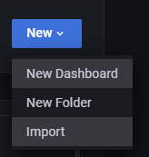

# Giám sát hiệu suất server với Node Exporter

# 1. Giới thiệu

- Việc giám sát hiệu suất server là cực kỳ quan trọng để đảm bảo hệ thống hoạt động ổn định và hiệu quả.
- Node Exporter là một công cụ mạnh mẽ trong bộ công cụ giám sát Prometheus, cho phép bạn thu thập và hiển thị các chỉ số hệ thống như CPU, RAM, DISK và nhiều thông số khác.
- Bài viết này sẽ hướng dẫn bạn từng bước cài đặt và cấu hình Node Exporter, giúp bạn tối ưu hóa hiệu suất và phát hiện sớm các vấn đề tiềm ẩn trong hệ thống của mình

# 2. Cài đặt Node Exporter

- Tải và Giải nén Node Exporter.

Chạy lệnh sau để tải xuống phiên bản 1.8.2 của Node Exporter. 

Sử dụng version bạn muốn ở đây: [https://github.com/prometheus/node_exporter/releases/](https://github.com/prometheus/node_exporter/releases/)

```jsx
$ curl -L -o node_exporter-1.8.2.linux-amd64.tar.gz https://github.com/prometheus/node_exporter/releases/download/v1.8.2/node_exporter-1.8.2.linux-amd64.tar.gz
```

- Giải nén file vừa tải:

```jsx
$ tar -zxf node_exporter-1.8.2.linux-amd64.tar.gz
```

- Kiểm tra phiên bản đã cài đặt:

```
$ ./node_exporter --version

node_exporter, version 1.8.2 (branch: HEAD, revision: f1e0e8360aa60b6cb5e5cc1560bed348fc2c1895)
  build user:       root@03d440803209
  build date:       20240714-11:53:45
  go version:       go1.22.5
  platform:         linux/amd64
  tags:             unknown
```

- Di chuyển file `node_exporter` từ thư mục giải nén vào `/usr/local/bin` :

```jsx
$ sudo cp node_exporter /usr/local/bin/node_exporter
```

- Cấu hình dịch vụ Node Exporter.

Tạo file dịch vụ cho Node Exporter:

```jsx
$ sudo vi /etc/systemd/system/node_exporter.service
```

```jsx
[Unit]
Description=NodeExporter
Wants=network-online.target
After=network-online.target

[Service]
TimeoutStartSec=0
User=nobody
Group=nogroup
ExecStart=/usr/local/bin/node_exporter --web.listen-address=:9100
Restart=on-failure

[Install]
WantedBy=multi-user.target
```

- Reload cấu hình và start Node Exporter:

```jsx
$ sudo systemctl daemon-reload
$ sudo systemctl restart node_exporter.service
$ sudo systemctl enable node_exporter.service
```

- Kiểm tra trạng thái dịch vụ Node Exporter:

```jsx
$ sudo systemctl status node_exporter.service
```

- Cấu hình firewall (nếu có). Nếu firewall đang chạy, hãy thêm quy tắc cho port `9100`:

```jsx
$ sudo firewall-cmd --permanent --zone=public --add-port=9100/tcp
$ sudo firewall-cmd --reload
```

# 4. **Cấu Hình Prometheus**

- Truy cập server Prometheus, mở file `prometheus.yml` và thêm job để thu thập số liệu từ Nginx exporter:

```jsx
scrape_configs:
  - job_name: 'API-APP'
    scrape_interval: 10s
    static_configs:
      - targets: ['172.18.1.11:9100', '172.18.1.12:9100', '172.18.1.13:9100']
    relabel_configs:
    - source_labels: [__address__]
      separator: ':'
      regex: '(.*):(.*)'
      replacement: '${1}'
      target_label: instance
```

​

- Khởi động lại Prometheus:

```jsx
sudo systemctl restart prometheus
```

# 5. Tạo Dashboard trong Grafana

- Truy cập vào **Dashboards** trên Grafana → Chọn **New** → Chọn **Import**



- Tải dashboard ở đây: [Server-Performance-Monitor-Node-Exporter.json](https://gist.github.com/thanhtlu213/67a34e64221490ea82e598f4c440b38e)
- Sau đó, upload file JSON và nhấn **Load**.


- Cấu hình Datasource:

Sau khi nhấn **Load**, bạn sẽ thấy một màn hình cho phép bạn cấu hình datasource. Chọn datasource mà bạn đã cấu hình cho Prometheus.


- Sau khi chọn datasource, nhấn **Import** để hoàn tất quá trình.
- Dashboard mới sẽ được thêm vào danh sách dashboard của bạn.


- Xem thêm chi tiết về các hàm trong Prometheus tại: [https://prometheus.io/docs/prometheus/latest/querying/functions/](https://prometheus.io/docs/prometheus/latest/querying/functions/)

# 6. Thiết lập cảnh báo

- Tạo file `node-exporter.rules`:

```jsx
$ sudo vi /etc/prometheus/alert_rules/node-exporter.rules
```

```jsx
groups:

- name: NodeExporter

  rules:

    ### CPU
    - alert: HostHighCpuLoad        # CPU load is > 80%
      expr: '(sum by (instance) (avg by (mode, instance) (rate(node_cpu_seconds_total{mode!="idle"}[2m]))) > 0.8) * on(instance) group_left (nodename) node_uname_info{nodename=~".+"}'
      for: 1m
      labels:
        severity: warning
      annotations:
        summary: Host high CPU load (instance {{ $labels.instance }})
        description: "CPU load is > 80%\n  VALUE = {{ $value }}"

    - alert: HostCpuHighIowait        # CPU iowait > 10%. A high iowait means that you are disk or network bound.
      expr: '(avg by (instance) (rate(node_cpu_seconds_total{mode="iowait"}[5m])) * 100 > 10) * on(instance) group_left (nodename) node_uname_info{nodename=~".+"}'
      for: 0m
      labels:
        severity: warning
      annotations:
        summary: Host CPU high iowait (instance {{ $labels.instance }})
        description: "CPU iowait > 10%. A high iowait means that you are disk or network bound.\n  VALUE = {{ $value }}"

    ### RAM
    - alert: HostOutOfMemory        # Node memory is filling up (< 10% left)
      expr: '(node_memory_MemAvailable_bytes / node_memory_MemTotal_bytes * 100 < 10) * on(instance) group_left (nodename) node_uname_info{nodename=~".+"}'
      for: 2m
      labels:
        severity: warning
      annotations:
        summary: Host out of memory (instance {{ $labels.instance }})
        description: "Node memory is filling up (< 10% left)\n  VALUE = {{ $value }}"

    - alert: HostSwapIsFillingUp        # Swap is filling up (>80%)
      expr: '((1 - (node_memory_SwapFree_bytes / node_memory_SwapTotal_bytes)) * 100 > 80) * on(instance) group_left (nodename) node_uname_info{nodename=~".+"}'
      for: 2m
      labels:
        severity: warning
      annotations:
        summary: Host swap is filling up (instance {{ $labels.instance }})
        description: "Swap is filling up (>80%)\n  VALUE = {{ $value }}"

    ### Network
    - alert: HostUnusualNetworkThroughputIn
      expr: '(sum by (instance) (rate(node_network_receive_bytes_total[2m])) / 1024 / 1024 > 100) * on(instance) group_left (nodename) node_uname_info{nodename=~".+"}'
      for: 5m
      labels:
        severity: warning
      annotations:
        summary: Host unusual network throughput in (instance {{ $labels.instance }})
        description: "Host network interfaces are probably receiving too much data (> 100 MB/s)\n  VALUE = {{ $value }}"

    - alert: HostUnusualNetworkThroughputOut
      expr: '(sum by (instance) (rate(node_network_transmit_bytes_total[2m])) / 1024 / 1024 > 100) * on(instance) group_left (nodename) node_uname_info{nodename=~".+"}'
      for: 5m
      labels:
        severity: warning
      annotations:
        summary: Host unusual network throughput out (instance {{ $labels.instance }})
        description: "Host network interfaces are probably sending too much data (> 100 MB/s)\n  VALUE = {{ $value }}"

    - alert: HostNetworkReceiveErrors
      expr: '(rate(node_network_receive_errs_total[2m]) / rate(node_network_receive_packets_total[2m]) > 0.01) * on(instance) group_left (nodename) node_uname_info{nodename=~".+"}'
      for: 2m
      labels:
        severity: warning
      annotations:
        summary: Host Network Receive Errors (instance {{ $labels.instance }})
        description: "Host {{ $labels.instance }} interface {{ $labels.device }} has encountered {{ printf \"%.0f\" $value }} receive errors in the last two minutes.\n  VALUE = {{ $value }}"

    ### Disk
    - alert: HostOutOfDiskSpace        # Disk is almost full (< 15% left)
      expr: '((node_filesystem_avail_bytes * 100) / node_filesystem_size_bytes < 15 and ON (instance, device, mountpoint) node_filesystem_readonly == 0) * on(instance) group_left (nodename) node_uname_info{nodename=~".+"}'
      for: 2m
      labels:
        severity: warning
      annotations:
        summary: Host out of disk space (instance {{ $labels.instance }})
        description: "Disk is almost full (< 15% left)\n  VALUE = {{ $value }}"

    - alert: HostUnusualDiskIo        # Time spent in IO is too high
      expr: '(rate(node_disk_io_time_seconds_total[1m]) * 100 > 70) * on(instance) group_left (nodename) node_uname_info{nodename=~".+"}'
      for: 2m
      labels:
        severity: warning
      annotations:
        summary: Host unusual disk IO (instance {{ $labels.instance }})
        description: "Time spent in IO is too high (> 70%) on {{ $labels.instance }}. Check storage for issues.\n  VALUE = {{ $value }}"

    - alert: HostUnusualDiskReadRate        # Disk is probably reading too much data (> 50 MB/s)
      expr: '(sum by (instance) (rate(node_disk_read_bytes_total[2m])) / 1024 / 1024 > 50) * on(instance) group_left (nodename) node_uname_info{nodename=~".+"}'
      for: 5m
      labels:
        severity: warning
      annotations:
        summary: Host unusual disk read rate (instance {{ $labels.instance }})
        description: "Disk is probably reading too much data (> 50 MB/s)\n  VALUE = {{ $value }}"

    - alert: HostUnusualDiskWriteRate        # Disk is probably writing too much data (> 50 MB/s)
      expr: '(sum by (instance) (rate(node_disk_written_bytes_total[2m])) / 1024 / 1024 > 50) * on(instance) group_left (nodename) node_uname_info{nodename=~".+"}'
      for: 2m
      labels:
        severity: warning
      annotations:
        summary: Host unusual disk write rate (instance {{ $labels.instance }})
        description: "Disk is probably writing too much data (> 50 MB/s)\n  VALUE = {{ $value }}"

    - alert: HostUnusualDiskReadLatency        # Disk latency is growing (read operations > 100ms)
      expr: '(rate(node_disk_read_time_seconds_total[1m]) / rate(node_disk_reads_completed_total[1m]) > 0.1 and rate(node_disk_reads_completed_total[1m]) > 0) * on(instance) group_left (nodename) node_uname_info{nodename=~".+"}'
      for: 2m
      labels:
        severity: warning
      annotations:
        summary: Host unusual disk read latency (instance {{ $labels.instance }})
        description: "Disk latency is growing (read operations > 100ms)\n  VALUE = {{ $value }}"

    - alert: HostUnusualDiskWriteLatency        # Disk latency is growing (write operations > 100ms)
      expr: '(rate(node_disk_write_time_seconds_total[1m]) / rate(node_disk_writes_completed_total[1m]) > 0.1 and rate(node_disk_writes_completed_total[1m]) > 0) * on(instance) group_left (nodename) node_uname_info{nodename=~".+"}'
      for: 2m
      labels:
        severity: warning
      annotations:
        summary: Host unusual disk write latency (instance {{ $labels.instance }})
        description: "Disk latency is growing (write operations > 100ms)\n  VALUE = {{ $value }}"

    ### Filesystem
    - alert: HostOutOfInodes        # Disk is almost running out of available inodes (< 10% left)
      expr: '(node_filesystem_files_free{fstype!="msdosfs"} / node_filesystem_files{fstype!="msdosfs"} * 100 < 10 and ON (instance, device, mountpoint) node_filesystem_readonly == 0) * on(instance) group_left (nodename) node_uname_info{nodename=~".+"}'
      for: 2m
      labels:
        severity: warning
      annotations:
        summary: Host out of inodes (instance {{ $labels.instance }})
        description: "Disk on {{ $labels.device }} mounted at {{ $labels.mountpoint }} is almost running out of available inodes (< 10% left)\n  VALUE = {{ $value }}"

```

- Thêm cấu hình `rule_files` trong `prometheus.yml`:

```jsx
rule_files:
  - "/etc/prometheus/alert_rules/node-exporter.rules"
```

- Khởi động lại service Prometheus:

```jsx
$ systemctl restart prometheus
```

- Nội dung thông báo về Telegram:

```jsx
🔥 Alerts Firing 🔥

🪪 HostCpuHighIowait
📝 Host CPU high iowait (instance 172.18.1.1)
📖 CPU iowait > 10%. A high iowait means that you are disk or network bound.
  VALUE = 13.636864406780353
🏷 Labels:
  alertname: HostCpuHighIowait
  instance: 172.18.1.1
  monitor: zns monitoring
  nodename: prod-app-0
  severity: warning
```

```jsx
🔥 Alerts Firing 🔥

🪪 HostUnusualDiskIo
📝 Host unusual disk IO (instance 172.18.1.1)
📖 Time spent in IO is too high on 172.18.1.1. Check storage for issues.
  VALUE = 0.6230545454531569
🏷 Labels:
  alertname: HostUnusualDiskIo
  device: vdb
  instance: 172.18.1.1
  job: ZNS-Database
  monitor: zns monitoring
  nodename: prod-app-01
  severity: warning
```